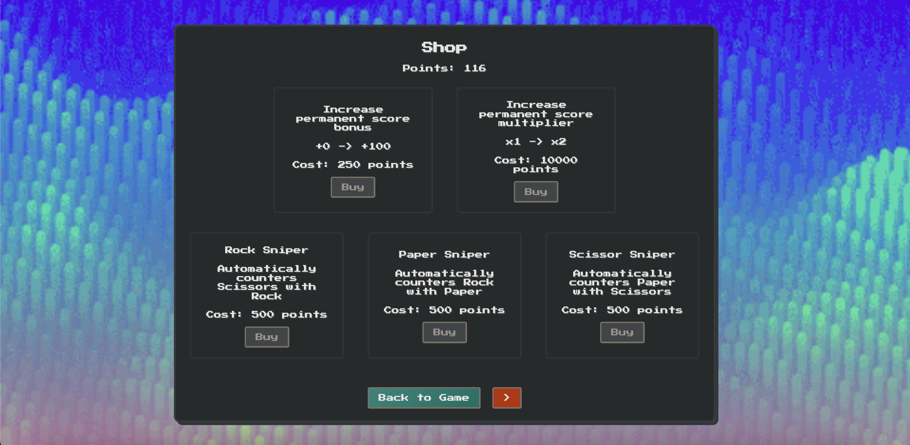

# Rock Paper Scissors Idle Game 🎮

An upgrade-driven idle game blending fast decision-making, resource management, and automation.  
Inspired by the simplicity of *Cookie Clicker* and the strategic scaling of *Balatro*, this project showcases full-stack web application development with a focus on gameplay, UI/UX, and cloud integration.

Play this game at https://rps-lac.vercel.app/

## 📸 Screenshots

| Main Game Screen | Shop Screen | Achievements Screen |
|:----------------:|:-----------:|:-------------------:|
|  |  |  |

---

## 🚀 Tech Stack

- **Frontend:** Angular 19.2.5
- **Database:** Supabase (PostgreSQL with JSONB saves)
- **Authentication:** Supabase Email/Password Auth
- **Cloud Sync:** Automatic save/load to cloud or local fallback
- **State Management:** Service-based reactive architecture (GameDataService)
- **Deployment:** _(to be added upon hosting)_

---

## 🎮 Gameplay Overview

- A random move — **Rock**, **Paper**, or **Scissors** — appears.
- Manually select the **winning counter-move** to earn points.
- Build **streaks** to boost point multipliers.
- Unlock **automated "Snipers"** that counter moves automatically, consuming limited fuel resources.
- Manage and replenish resources (**rocks**, **papers**, **scissors**) using **generators** and **upgrades**.
- Progress is tracked with a robust **achievement system** saved across devices.

---

## 🛠️ Core Features

### ☁️ Cloud Save System
- Save progress and achievements atomically to Supabase.
- Seamless login/logout with automatic fallback to local storage when offline.

### 🏗️ Upgrade System
- Purchase score boosts, generation upgrades, and sniper efficiency improvements.
- Upgrade mechanics combine exponential and linear scaling models for balance.

### 🔫 Automated "Snipers"
- Rock, Paper, and Scissors snipers that auto-play correct moves.
- Requires strategic fuel management to sustain automation.

### 🏆 Achievement System
- Unlock milestones based on performance and progression.
- Fully integrated into cloud saves for persistent tracking.

### ⚡ Dynamic Generators
- Passive resource generation with adjustable interval speeds and output quantities.
- Upgrade generators for strategic scaling.

### 🎨 Responsive UI
- Retro pixel-art-inspired theme
---

## 📚 Key Learning Outcomes

- Integrating **Supabase authentication and database** in a real-world Angular SPA.
- Building a **reactive, service-driven state management system** without external libraries.
- Creating **engaging idle game loops** through incremental upgrades.
- Ensuring **data integrity and atomic saves** across local and cloud environments.
- Applying **game design principles** for player retention, reward systems, and UX.

---

## 🧠 Why This Project Matters

This project demonstrates a **full-stack single-page application (SPA)** capable of:

- Handling **real-time player interactions** and dynamic game state management.
- **Saving and syncing** complex data structures efficiently with cloud services.
- **Designing player engagement systems** (idle mechanics, achievements, upgrade paths).
- Building a scalable, modular architecture using **modern Angular best practices**.
---
