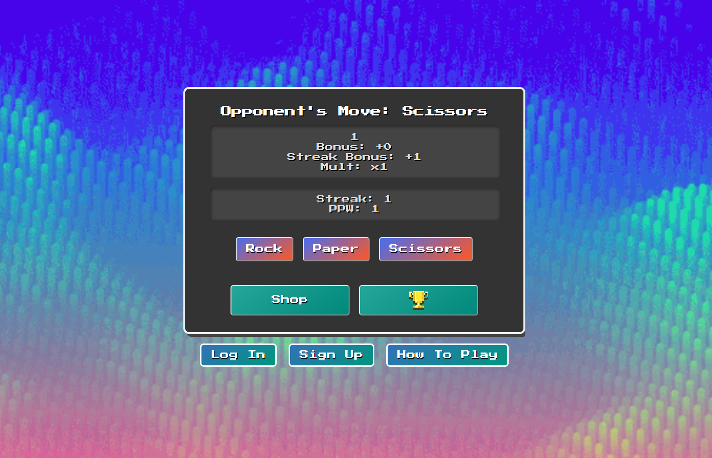
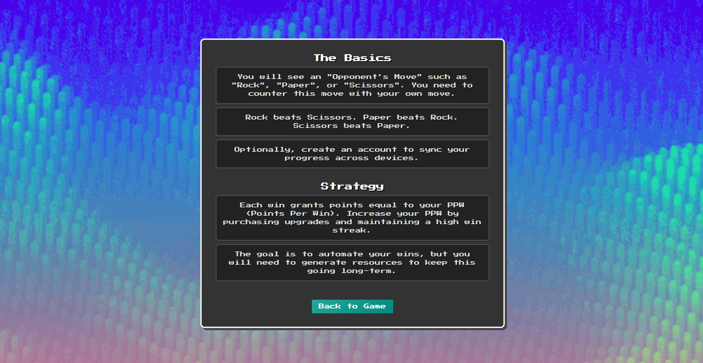
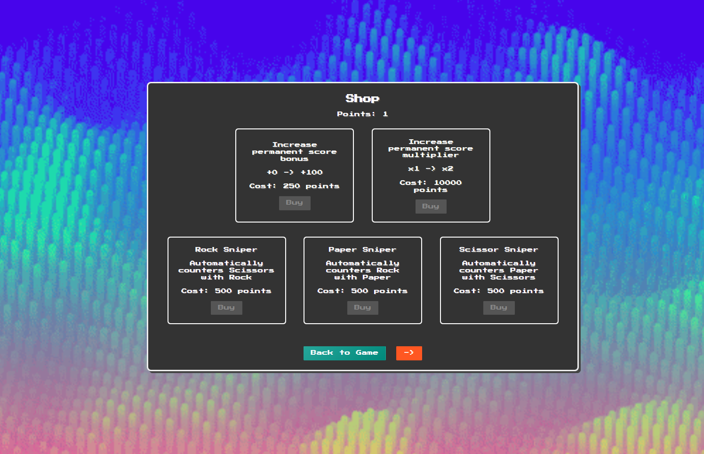
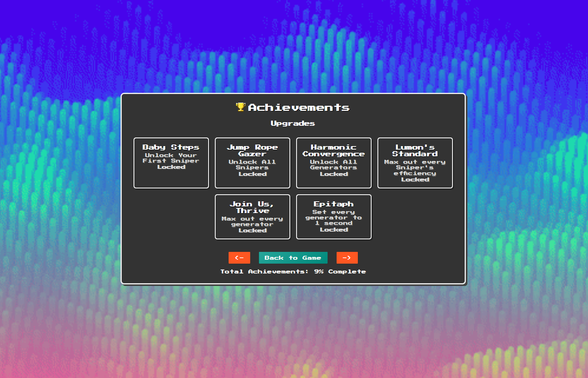
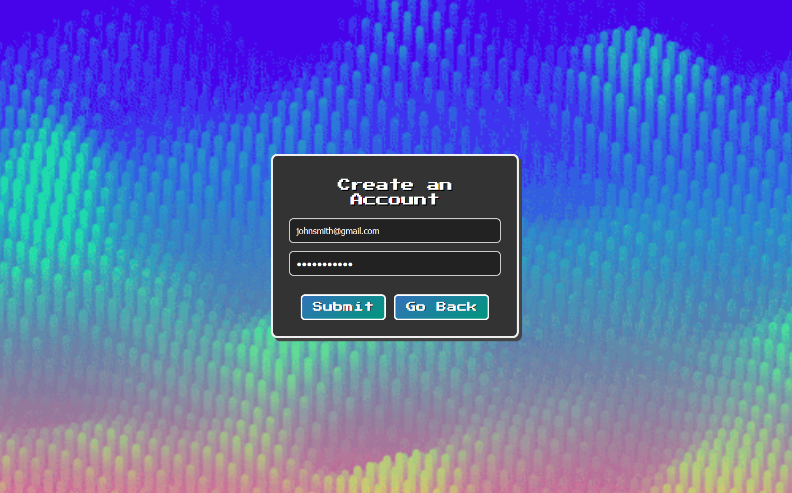
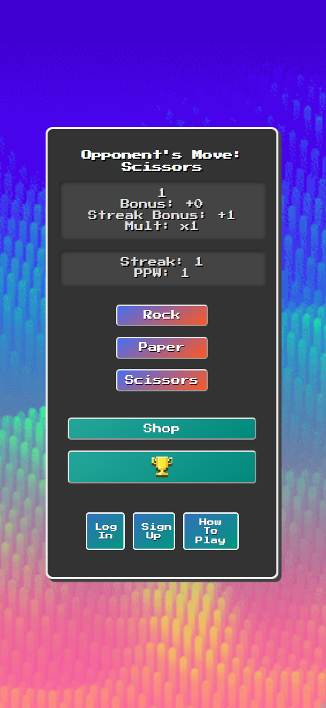
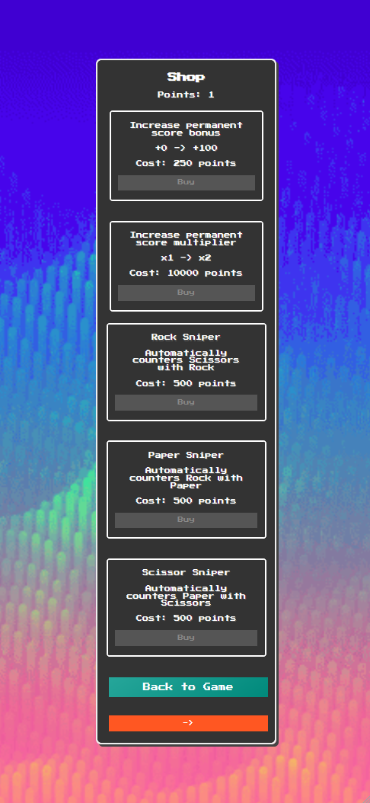
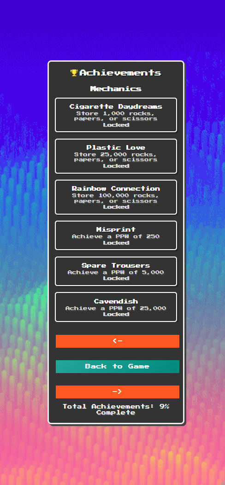
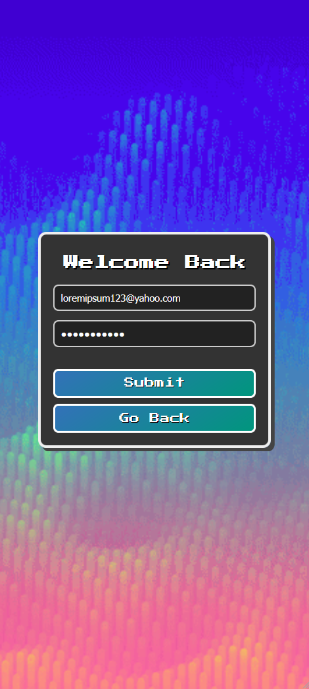

# Rock Paper Scissors Idle Game 🎮

An upgrade-driven idle game blending resource management and automation.  
Inspired by the simplicity of *Cookie Clicker* and the strategic scaling of *Balatro*, this project showcases full-stack web application development with a focus on gameplay, UI/UX, and cloud integration.

Play this game at https://rps-lac.vercel.app/

## 🚀 Tech Stack

- Frontend: Angular 19.2.5
- Database: Supabase (PostgreSQL with JSONB saves)
- Authentication: Supabase Email/Password Auth
- Deployment: Vercel

## 🎮 Gameplay Overview

- A random move — Rock, Paper, or Scissors — appears.
- Manually select the winning counter-move to earn points.
- Each win grants points equal to your PPW (Points Per Win). Increase your PPW by purchasing upgrades and maintaining a high win streak.
- Unlock automated "Snipers" that counter moves automatically, consuming limited fuel resources.
- Manage and replenish resources (rocks, papers, scissors) using generators and upgrades.
- Progress is tracked with a robust achievement system saved across devices.

## 🛠️ Core Features

### 🏗️ Game Shop

- Purchase permanent score bonuses, multipliers, automatic "snipers", and resource generators.
- Each sniper's efficiency can be upgrades such that moves are automatically countered at a much faster rate.
- Generators can be upgraded allowing more fuel produced per interval. Initially, this is 1 resource per 30 seconds. However, this can be maxed-out to generate 30 resources per 1 second.
- Upgrade costs combine exponential and linear scaling models for balance.

### 🏆 Achievement System

- To provide a sense of purpose, players can unlock achievements based on performance and progression.
- Along with other key gameplay elements, achievements are initally saved locally and sent to the cloud upon account creation. This ensures one's progress is not lost.

### ☁️ Cloud Save System

- When users choose to create an account, they their saves are automatically sent to the cloud. This allows them to play the same save file across devices.
- Prior to an account being created, data is saved to the browser. Upon creating an account, one's local saves are transfered to their cloud save.
- Logging back in will restore the user's data as it was at the last save.
- User Authentication is done with an email/password using Supabase.

### 📱 Mobile Support

  
  
  
  

- Each game screen has mobile support, allowing anyone to play anywhere they wish.
